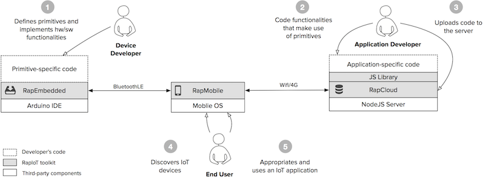

# RapIoT Toolkit (Partial description)

RapIoT is a software platform for simple programming of ecologies of IoT devices and services. It builds on top of IoT-enabling technologies such as MQTT, CoAP and BTLE.

RapIoT is part of *Tiles*, an inventor toolbox to support the design and making of interactive objects for learning and play. For more information [tilestoolkit.io](http://tilestoolkit.io)

For furter references and details please read:
S.Mora, F. Gianni and M.Divitini. “RapIoT Toolkit: Rapid Prototyping of Collaborative Internet of Things Applications”. In proceedings of the International Conference on Collaboration Technologies and Systems (CTS), 2016. [preprint](https://dl.dropboxusercontent.com/u/4495822/Papers/Papers/2016_RapIoT.pdf)

RapIoT is released under the [Apache 2.0 license terms](https://tldrlegal.com/license/apache-license-2.0-(apache-2.0)).

# RapIoT Fundamentals

## Data Primitives

RapIoT enables the definition, implementation and manipulation of *data type primitives*. RapIoT's primitives allow to abstract low-level implemenetation details and provide a loosely-coupled interface between different achitectural layers. Data types primitives facilitate the development of IoT architectures in mulpliple ways:

- Act as a loosely coupled interface between devices and applications, allowing devices to serve different applications without need for reprogramming their firmware

- Allow for centralising the application login in the cloud layer, offering a platform as a service and simplifying the development of systems that make use of ecologies of devices distribuited to multiple users/environments

- Facilitate collaboration among developers working on different IoT layers by providing simple constructs to be used to describe the data exchanged between embedded devices and applications

- Allow non-experts to think in terms of high- level abstractions without dealing with hardware complexities e.g. “shake, clockwise rotation, free fall” for physical manipulations recognised by accelerometer data

Example of data primitives are:

*Input primitives* a discrete information sensed by an IoT device; for example a data-point captured by a sensor or a manipulation performed via a user interface

*Output primitves* an action that can be performed by the IoT device via output features such as actuators or displays, for example a motor spinning or a LED (Light Emitting Diode) blinking

## Architecture 

RapIoT composed by:
* *RapEmbedded:* an Arduino library to support definition and implementation of input and output primitives on embedded hardware devices;
* *RapMobile:* a cross-platform mobile app that acts as internet gateway and allows to discover and configure IoT devices;
* *RapCloud:* a cloud service, real-time APIs and javascript library that support the development of applications that interact with IoT devices.

### RapEmbedded

TBD

### RapMobile

RapMobile is a software application for smartphones that wirelessly connects IoT devices to your application via RapCloud. This is required for the interaction primitives to be captured and exchanged between the Square modules and your application. 

To setup RapMobile on your smartphone (Android or iPhone) follow [these instructions](./MOBILE). 

### RapCloud

RapCloud provides a centralized, software interface to interact with ecologies Arduino-based IoT devices. It allows developers that are not specialized in writing code for embedded devices to create applications using simple javascript instructions. Functionalities provided by multiple devices can be programmed from routines running in a centralized cloud environment; without requiring physical access to the hardware modules. 

A RapIoT test server is provided at http://138.68.144.206 with administrator interface at http://admin.tilestoolkit.io
If you want to setup your own Tiles Cloud server follow [these instructions](./CLOUD)

#### Javascript library and APIs

TBD

# Build your first Rap Application (TBD)

### STEP 1

Build your IoT device with Arduino and RapEmbedded. As an alternative you can use RapIoT-ready IoT devices called Tiles Squares.

### STEP 2 

Open the RapMobile app on your smartphone. This is how it looks like.

1. Tap on “Click to connect to server” 
2. Type in your  username. If you don’t have one it will be automatically created. OPTIONAL: If you have a custom RapIoT server type the address here, otherwise leave the default server.
3. Connect to one or more square modules
4. Leave the Tiles connect app open on your phone

### STEP 3

Write some code in javascript usint the provided libray TBD.
